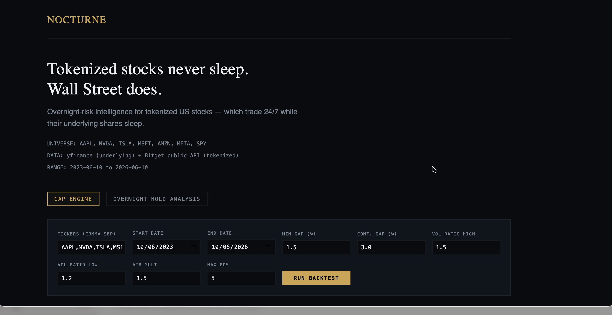
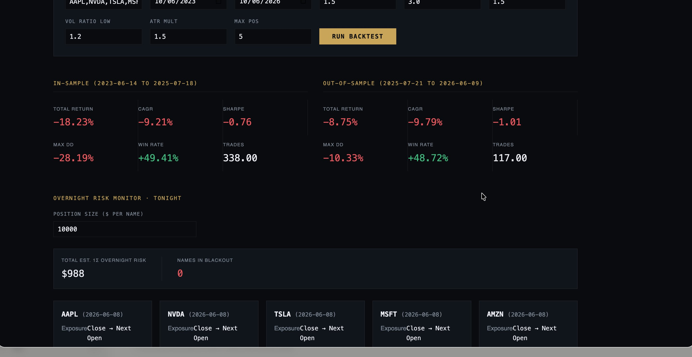
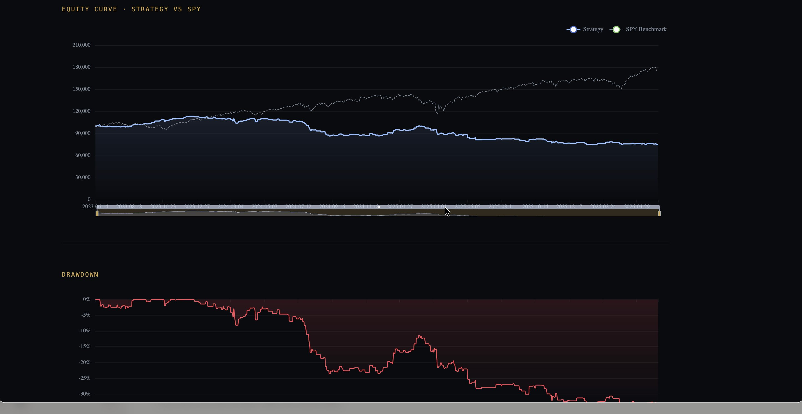
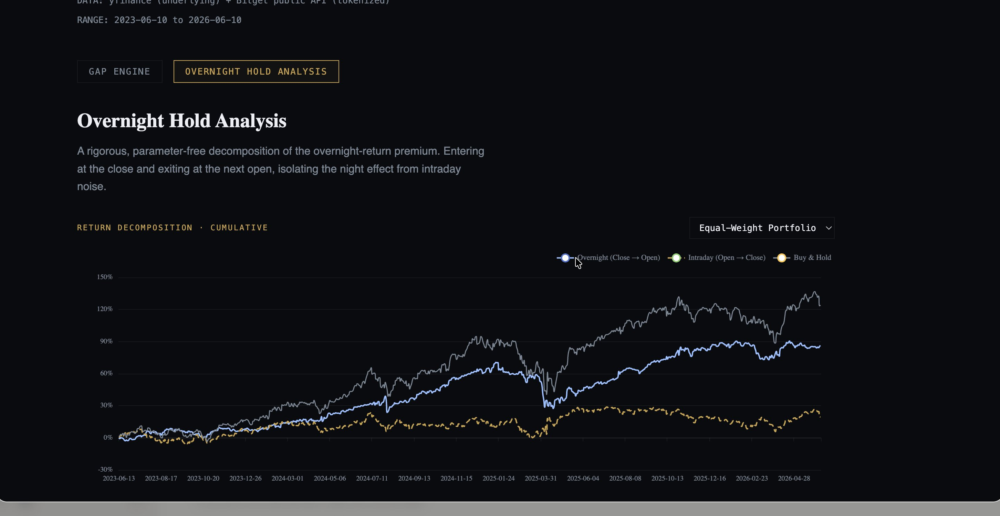
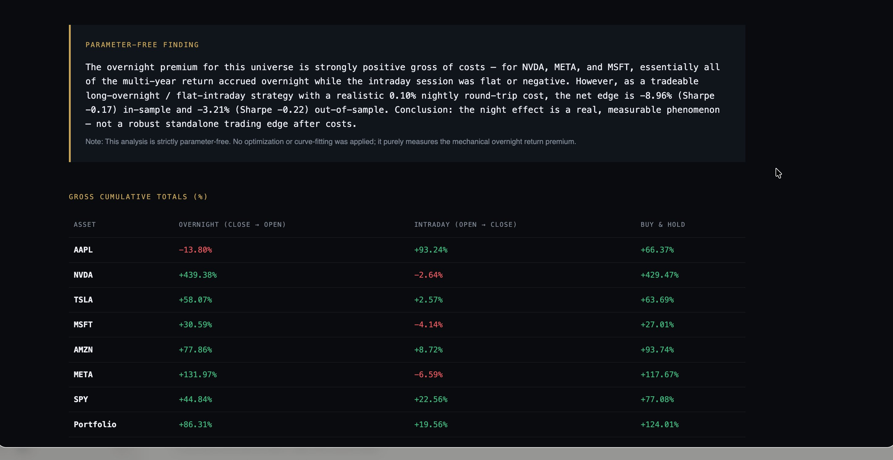
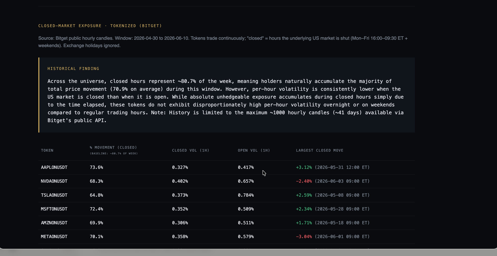
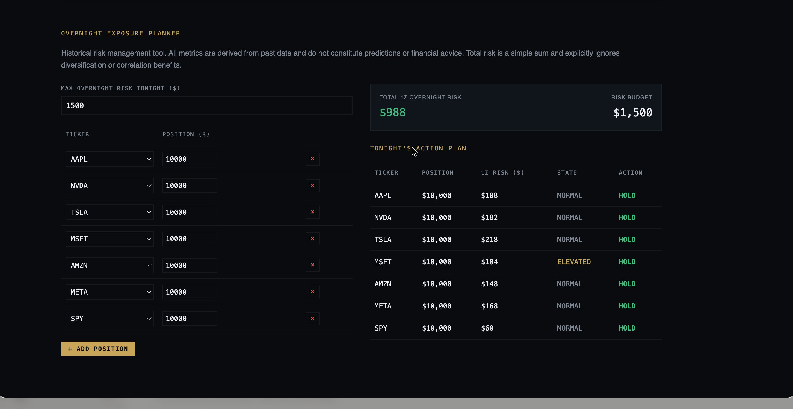

<div align="center">

# NOCTURNE

### Overnight-risk intelligence for tokenized US stocks

*Tokenized stocks never sleep. Wall Street does.*

Tokenized US equities trade **24/7** on venues like Bitget, while the shares they track trade only **6.5 hours a day**. Nocturne measures, decomposes, and helps manage the unhedgeable overnight risk that gap creates — on **real market data**, with **no curve-fitting and no faked results**.

**🌙 [Live interactive app →](https://nocturne-suz6.onrender.com)**  ·  **[Instant snapshot →](https://theeagle2407.github.io/Nocturne/)**  ·  **[Source →](https://github.com/theeagle2407/Nocturne)**

<sub>The live app runs the real backend — edit the tickers/dates and re-run the backtest yourself. On the free hosting tier the first load may take ~30s to wake the server. The instant snapshot is always-on with no backend and loads immediately.</sub>

</div>

---

## The problem

When you hold a tokenized stock (e.g. `AAPLon` on Bitget), you are exposed around the clock. But the underlying — Apple — only prices for 6.5 hours on weekdays. Every night, every weekend, and every market holiday, you carry exposure to an asset whose reference market is **closed**, with no way to hedge in the underlying until it reopens. That overnight window is where the gaps happen, where the risk concentrates, and where most holders are flying blind.

Nocturne is a research-and-risk terminal built specifically for that window.

> **What Nocturne is — and isn't.** Nocturne is **not** an autonomous trading bot and it does **not** claim a profitable edge. It is a **risk tool**. In fact, it sets out to prove the *opposite* of a get-rich strategy: that you generally **cannot trade your way out** of overnight exposure, so the rational response is to **measure and manage it**. The backtests below honestly lose money — and that is the point. The value is rigor, not alpha.

---

## What it does



Nocturne has five components, all driven by live data:

### 1. Gap Engine — an honest backtest
An interactive overnight-gap strategy (FADE vs CONTINUATION, volume-confirmed, ATR-based exits, 0.10% per-trade costs, FOMC days excluded), with a strict **70/30 in-sample / out-of-sample split** and equity benchmarked against SPY.



A representative run produces **in-sample total return ≈ −18%** and **out-of-sample ≈ −9%** across **~455 trades** — and it is *worse* out-of-sample, the signature of **no real edge**. We show this on purpose. (Numbers drift because data rolls forward; the qualitative conclusion does not.)



### 2. Overnight Hold Analysis — a parameter-free decomposition
Splits every name's return into **overnight (close→open)**, **intraday (open→close)**, and **buy & hold**, per ticker and as an equal-weight portfolio.



The striking, real finding: for **NVDA, META, and MSFT, essentially the entire multi-year gain accrued overnight**, while the intraday session was flat or negative. But after a realistic 0.10% nightly cost, even this is **not** a robust tradeable edge — marginally negative in-sample, negative out-of-sample.



> **A rigor feature, not a slogan:** the "Parameter-Free Finding" prose is **generated from the same computed values** that populate the metrics table. The narrative and the numbers are literally the same variables — they cannot drift apart or be quietly inflated.

### 3. Closed-Market Exposure · Tokenized (Bitget) — the tokenized-specific layer
Uses **real Bitget public hourly candles** for the actual tokenized symbols (`AAPLONUSDT`, `NVDAONUSDT`, …) to measure how these tokens behave while the US market is shut.



The honest result: closed hours are **~80.7% of the week**, so tokens naturally accumulate **most of their price movement (~70.9%)** then — but **per-hour volatility is actually *lower* when the market is closed**, not higher. So overnight risk is a function of **time elapsed**, not panic. That is a measured, tokenized-specific insight, not a vibe.

### 4. Overnight Risk Monitor
Per-name overnight exposure, historical 1σ move, worst historical move, return concentration, and a NORMAL/ELEVATED risk state (10-day vs 60-day realized vol).

### 5. Overnight Exposure Planner — the actionable output


Enter your tokenized holdings and a risk budget; Nocturne returns **tonight's action plan** — HOLD / TRIM / FLATTEN per name, prioritized by blackout → concentration → 1σ risk. This is the practical payoff of the whole tool.

---

## Verifiable usage evidence

Per the hackathon baseline (real & runnable, clear problem, verifiable evidence):

- **Backtest trade logs:** ~455 individual trades with date, ticker, mode, direction, gap %, entry, exit, and return — searchable, filterable, and paginated in-app.
- **Real Yahoo Finance data:** daily OHLCV fetched live from the public chart API on every backtest run (`POST /api/backtest`, `POST /api/overnight`). No synthetic data.
- **Real Bitget market data:** hourly candles for 7 tokenized symbols (`AAPLon, NVDAon, TSLAon, MSFTon, AMZNon, METAon, SPYon`) via Bitget's public API, used in the closed-market analysis.
- **Reproducible:** clone, `npm install`, `npm start`, and recompute everything yourself.

---

## Bitget integration & data provenance

| Layer | Source | How it's used |
|---|---|---|
| Underlying equities | **Yahoo Finance** public chart API (daily OHLCV) | Fetched **live** by the Node backend on every backtest / decomposition |
| Tokenized assets | **Bitget public market API** (hourly candles) | Real candles for the tokenized symbols; powers the Closed-Market Exposure panel |

**Honest note on the Bitget layer:** Bitget's public candle endpoint caps history at ~1000 hourly candles (~41 days), so the closed-market analysis is computed over a recent **real snapshot** of Bitget data rather than re-pulled on each page load. The data is genuine Bitget market data; it is a snapshot by necessity of the API limit, and the in-app note says so.

**Why analytics run on the underlying equity:** the overnight gap only *exists* on the asset that closes. The tokenized wrapper trades continuously and has no "gap." So the underlying equity is the correct substrate for measuring the gap, while the **tokenized-specific risk is measured directly on Bitget data** in the closed-market panel. The two layers answer two different, complementary questions.

---

## Run it locally (interactive version)

```bash
git clone https://github.com/theeagle2407/Nocturne.git
cd Nocturne
npm install
npm start
```

Then open **http://localhost:3000**. The server boots the interactive dashboard (`app.html`) and fetches live historical data from Yahoo Finance on every backtest. Requires Node.js 18+.

> **Cloud-hosting note:** the [live app](https://nocturne-suz6.onrender.com) runs the full backend in the cloud. Yahoo's public chart API can rate-limit datacenter IPs, so the server sends a browser User-Agent and falls back across Yahoo hosts to stay reliable; on the free hosting tier the first request may take ~30s to wake the instance. For an instant, always-on view with no backend, use the static snapshot below.

## Live snapshot (no install required)

`index.html` is a fully self-contained static snapshot of the dashboard — all data baked in, zero backend. **Double-click it to view the full dashboard in any browser**, or serve it for free via GitHub Pages:

**Instant snapshot (always-on):** **https://theeagle2407.github.io/Nocturne/**

---

## Methodology

The full methodology — gap-engine signal logic, the overnight/intraday decomposition math, the in-sample/out-of-sample protocol, cost assumptions, FOMC handling, and the closed-market computation — is documented in **[METHODOLOGY.md](METHODOLOGY.md)**.

## Honest limitations

- **No tradeable edge — by design.** The gap strategy loses money and the overnight premium does not survive costs. Nocturne is a risk and research tool, not a profit engine.
- **Underlying-equity substrate.** Core analytics run on the underlying equities (Yahoo), since that's where the gap exists; tokenized-specific behavior is carried by the Bitget closed-market panel.
- **Bitget history is a snapshot.** Limited to ~41 days by the public API's ~1000-candle cap.
- **Not financial advice.** Past performance is not indicative of future results.

## Tech stack

Node.js · Express · Axios · Yahoo Finance public chart API · Bitget public market API · vanilla JS + Chart.js frontend (the "Midnight Desk" UI).

## Repository contents

| File | What it is |
|---|---|
| `server.js` | Express backend — gap-engine + overnight decomposition, live Yahoo fetch |
| `app.html` | Interactive dashboard (served at `/` by the backend) |
| `index.html` | Static snapshot of the dashboard (GitHub Pages / offline viewing) |
| `METHODOLOGY.md` | Full technical methodology |
| `package.json` | Dependencies + `npm start` script |
| `0X-*.png` | Dashboard screenshots used in this README |

---

<div align="center">
<sub>Built for the Bitget AI Base Camp Hackathon S1 · Track 3 (US Stock AI Trading). Not financial advice.</sub>
</div>
